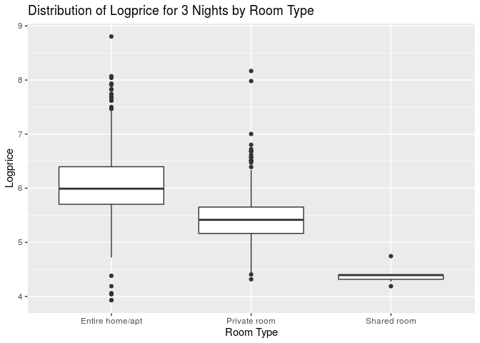

HW 04: Model diagnostics
================
Hannah Wang
10 October 2019

``` r
library(tidyverse)
library(broom)
library(knitr) 
library(rms)
```

``` r
airbnb_mod <- read_csv("data/airbnb_mod.csv")
```

### Question 1

``` r
airbnb_mod <- airbnb_mod %>%
  mutate(log_price_3 = log(price_3_nights))
```

``` r
logprice_model <- lm(log_price_3 ~ prop_type_simp + number_of_reviews + review_scores_rating, data = airbnb_mod)
kable(tidy(logprice_model, conf.int = TRUE, level = 0.95),digits=5)
```

| term                        |  estimate | std.error | statistic | p.value |  conf.low | conf.high |
| :-------------------------- | --------: | --------: | --------: | ------: | --------: | --------: |
| (Intercept)                 |   5.24423 |   0.35894 |  14.61018 | 0.00000 |   4.54020 |   5.94825 |
| prop\_type\_simpGuest suite | \-0.20559 |   0.05052 | \-4.06934 | 0.00005 | \-0.30469 | \-0.10650 |
| prop\_type\_simpHouse       | \-0.05715 |   0.04040 | \-1.41479 | 0.15732 | \-0.13639 |   0.02208 |
| prop\_type\_simpOther       | \-0.03232 |   0.04546 | \-0.71083 | 0.47729 | \-0.12149 |   0.05685 |
| number\_of\_reviews         | \-0.00138 |   0.00019 | \-7.28060 | 0.00000 | \-0.00175 | \-0.00101 |
| review\_scores\_rating      |   0.00809 |   0.00368 |   2.19688 | 0.02817 |   0.00087 |   0.01531 |

logprice-hat = 5.244 - 0.206 \* prop\_type\_simpGuestsuite - 0.057 \*
prop\_type\_simpHouse - 0.032 \* prop\_type\_simpOther - 0.001 \*
number\_of\_reviews + 0.008 \* review\_scores\_rating

### Question 2

For every 1 point increase in average review score, we expect the median
total cost for 3 nights to be multiplied by a factor of exp(0.008) =
$1.008.

### Question 3

``` r
logprice_model_full <- lm(log_price_3 ~ prop_type_simp + number_of_reviews + review_scores_rating + room_type, data = airbnb_mod)
kable(tidy(logprice_model, conf.int = TRUE, level = 0.95),digits=5)
```

| term                        |  estimate | std.error | statistic | p.value |  conf.low | conf.high |
| :-------------------------- | --------: | --------: | --------: | ------: | --------: | --------: |
| (Intercept)                 |   5.24423 |   0.35894 |  14.61018 | 0.00000 |   4.54020 |   5.94825 |
| prop\_type\_simpGuest suite | \-0.20559 |   0.05052 | \-4.06934 | 0.00005 | \-0.30469 | \-0.10650 |
| prop\_type\_simpHouse       | \-0.05715 |   0.04040 | \-1.41479 | 0.15732 | \-0.13639 |   0.02208 |
| prop\_type\_simpOther       | \-0.03232 |   0.04546 | \-0.71083 | 0.47729 | \-0.12149 |   0.05685 |
| number\_of\_reviews         | \-0.00138 |   0.00019 | \-7.28060 | 0.00000 | \-0.00175 | \-0.00101 |
| review\_scores\_rating      |   0.00809 |   0.00368 |   2.19688 | 0.02817 |   0.00087 |   0.01531 |

logprice-hat = 5.513 - 0.145 \* prop\_type\_simpGuestsuite + 0.279 \*
prop\_type\_simpHouse + 0.167 \* prop\_type\_simpOther - 0.001 \*
number\_of\_reviews + 0.006 \* review\_scores\_rating - 0.745 \*
room\_typePrivateroom - 1.829 \*
room\_typeSharedroom

### Question 4

``` r
ggplot(data = airbnb_mod, mapping = aes(x = room_type, y = log_price_3)) + geom_boxplot() + labs(title = "Distribution of Logprice for 3 Nights by Room Type", x = "Room Type", y = "Logprice")
```

<!-- -->

ANOVA F Test

H0: βentirehome=βprivate=βshared=0

Ha: at least one βj is not equal to
0

``` r
reduced <- lm(log_price_3 ~ prop_type_simp + number_of_reviews + review_scores_rating, data = airbnb_mod)

full <- lm(log_price_3 ~ prop_type_simp + number_of_reviews + review_scores_rating + room_type, data = airbnb_mod)

kable(anova(reduced, full), format="markdown", digits = 3)
```

| Res.Df |     RSS | Df | Sum of Sq |       F | Pr(\>F) |
| -----: | ------: | -: | --------: | ------: | ------: |
|   1670 | 592.556 | NA |        NA |      NA |      NA |
|   1668 | 408.084 |  2 |   184.472 | 377.006 |       0 |

At least one coeffecient associated with `room_type` is not 0.
Therefore, `room_type` is a significant predictor of cost for 3 nights.

### Question 5

``` r
price_output <- augment(logprice_model_full) %>%
  mutate(obs_num = row_number())

price_output %>%
  slice(1:5)
```

    ## # A tibble: 5 x 14
    ##   .rownames log_price_3 prop_type_simp number_of_revie… review_scores_r…
    ##   <chr>           <dbl> <chr>                     <dbl>            <dbl>
    ## 1 1                5.19 House                       120               96
    ## 2 2                7.74 Other                        92               95
    ## 3 3                5.82 Other                       181               88
    ## 4 4                5.36 House                        48               88
    ## 5 5                4.36 House                       198               93
    ## # … with 9 more variables: room_type <chr>, .fitted <dbl>, .se.fit <dbl>,
    ## #   .resid <dbl>, .hat <dbl>, .sigma <dbl>, .cooksd <dbl>,
    ## #   .std.resid <dbl>, obs_num <int>

### Question 6

We will use hi \> 2(p+1) / n for the leverage threshold. If an
observation’s leverage is greater than 2 \* (number of predictor
variables + 1) / number of observations, then the observation is a high
leverage point.

``` r
leverage_threshold <- 2*(4+1)/nrow(airbnb_mod)

ggplot(data = price_output, aes(x = obs_num,y = .hat)) + 
  geom_point(alpha = 0.7) + 
  geom_hline(yintercept = leverage_threshold,color = "red")+
  labs(x = "Observation Number",y = "Leverage",title = "Leverage") +
  geom_text(aes(label=ifelse(.hat > leverage_threshold, as.character(obs_num), "")), nudge_x = 4)
```

<!-- -->

\_\_\_\_\_ observations are considered high leverage.

``` r
ggplot(data = price_output, aes(x = obs_num, y = .cooksd)) + 
  geom_point(alpha = 0.7) + 
  geom_hline(yintercept=1,color = "red")+
  labs(x= "Observation Number",y = "Cook's Distance",title = "Cook's Distance") +
  geom_text(aes(label = ifelse(.hat>1,as.character(obs_num),"")))
```

<!-- -->

Based on Cook’s Distance, these points do not have a significant
influence on model coefficients. Cook’s Distance is the change in
predicted price when an observation is dropped. None of the observations
have a Cook’s Distance greater than the threshold of 1, so they do not
have significant influences on the model coefficients.

### Question 7

``` r
ggplot(data = price_output, aes(x = .fitted,y = .std.resid)) +
  geom_point(alpha = 0.7) + 
  geom_hline(yintercept = 0,color = "red") +
  geom_hline(yintercept = -2,color = "red",linetype = "dotted") +
  geom_hline(yintercept = 2,color = "red",linetype = "dotted") +
  labs(x ="Predicted Value",y ="Standardized Residuals",title = "Standardized Residuals vs. Predicted") +
  geom_text(aes(label = ifelse(abs(.std.resid) >2,as.character(obs_num),"")), nudge_x = 0.3)
```

<!-- -->

``` r
price_output %>% filter(abs(.std.resid) > 2) %>% 
  select(prop_type_simp, number_of_reviews, review_scores_rating, room_type)
```

    ## # A tibble: 75 x 4
    ##    prop_type_simp number_of_reviews review_scores_rating room_type      
    ##    <chr>                      <dbl>                <dbl> <chr>          
    ##  1 Other                         92                   95 Entire home/apt
    ##  2 Other                         53                   96 Entire home/apt
    ##  3 Other                         52                   95 Entire home/apt
    ##  4 Other                         29                   98 Entire home/apt
    ##  5 Guest suite                   73                   87 Entire home/apt
    ##  6 House                         95                   98 Entire home/apt
    ##  7 House                         63                   99 Entire home/apt
    ##  8 Other                         13                   97 Private room   
    ##  9 House                         33                   99 Entire home/apt
    ## 10 House                        197                   96 Entire home/apt
    ## # … with 65 more rows

75 observations are considered to have standardized residuals with large
magnitude.

``` r
ggplot(data = price_output, mapping = aes(x = .std.resid)) + geom_histogram() + labs(title = "Distribution of Standard Residuals")
```

<!-- -->

EXPLANATION

### Question 8

### Overall (do not delete\!)
