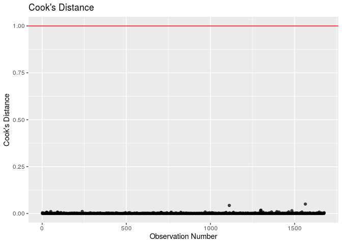

HW 04: Model diagnostics
================
Hannah Wang
10 October 2019

``` r
library(tidyverse)
library(broom)
library(knitr) 
library(rms)
```

``` r
airbnb_mod <- read_csv("data/airbnb_mod.csv")
```

### Question 1

``` r
airbnb_mod <- airbnb_mod %>%
  filter(!is.na(price_3_nights), !is.na(prop_type_simp), !is.na(room_type), !is.na(number_of_reviews), !is.na(review_scores_rating)) %>%
  mutate(log_price_3 = log(price_3_nights))
```

``` r
logprice_model <- lm(log_price_3 ~ prop_type_simp + number_of_reviews + review_scores_rating, data = airbnb_mod)
kable(tidy(logprice_model, conf.int = TRUE, level = 0.95),digits=5)
```

| term                        |  estimate | std.error | statistic | p.value |  conf.low | conf.high |
| :-------------------------- | --------: | --------: | --------: | ------: | --------: | --------: |
| (Intercept)                 |   5.24423 |   0.35894 |  14.61018 | 0.00000 |   4.54020 |   5.94825 |
| prop\_type\_simpGuest suite | \-0.20559 |   0.05052 | \-4.06934 | 0.00005 | \-0.30469 | \-0.10650 |
| prop\_type\_simpHouse       | \-0.05715 |   0.04040 | \-1.41479 | 0.15732 | \-0.13639 |   0.02208 |
| prop\_type\_simpOther       | \-0.03232 |   0.04546 | \-0.71083 | 0.47729 | \-0.12149 |   0.05685 |
| number\_of\_reviews         | \-0.00138 |   0.00019 | \-7.28060 | 0.00000 | \-0.00175 | \-0.00101 |
| review\_scores\_rating      |   0.00809 |   0.00368 |   2.19688 | 0.02817 |   0.00087 |   0.01531 |

logprice-hat = 5.244 - 0.206 \* prop\_type\_simpGuestsuite - 0.057 \*
prop\_type\_simpHouse - 0.032 \* prop\_type\_simpOther - 0.001 \*
number\_of\_reviews + 0.008 \* review\_scores\_rating

### Question 2

For every 1 point increase in average review score, we expect the median
total cost for 3 nights to be multiplied by a factor of exp(0.008) =
$1.008.

### Question 3

``` r
logprice_model_full <- lm(log_price_3 ~ prop_type_simp + number_of_reviews + review_scores_rating + room_type, data = airbnb_mod)
kable(tidy(logprice_model_full, conf.int = TRUE, level = 0.95),digits=5)
```

| term                        |  estimate | std.error |  statistic | p.value |  conf.low | conf.high |
| :-------------------------- | --------: | --------: | ---------: | ------: | --------: | --------: |
| (Intercept)                 |   5.51289 |   0.29892 |   18.44273 | 0.00000 |   4.92659 |   6.09919 |
| prop\_type\_simpGuest suite | \-0.14503 |   0.04201 |  \-3.45215 | 0.00057 | \-0.22743 | \-0.06263 |
| prop\_type\_simpHouse       |   0.27884 |   0.03574 |    7.80083 | 0.00000 |   0.20873 |   0.34895 |
| prop\_type\_simpOther       |   0.16683 |   0.03850 |    4.33351 | 0.00002 |   0.09132 |   0.24234 |
| number\_of\_reviews         | \-0.00120 |   0.00016 |  \-7.63618 | 0.00000 | \-0.00151 | \-0.00089 |
| review\_scores\_rating      |   0.00558 |   0.00307 |    1.81945 | 0.06902 | \-0.00044 |   0.01159 |
| room\_typePrivate room      | \-0.74494 |   0.02829 | \-26.33320 | 0.00000 | \-0.80042 | \-0.68945 |
| room\_typeShared room       | \-1.82881 |   0.18891 |  \-9.68082 | 0.00000 | \-2.19933 | \-1.45828 |

logprice-hat = 5.513 - 0.145 \* prop\_type\_simpGuestsuite + 0.279 \*
prop\_type\_simpHouse + 0.167 \* prop\_type\_simpOther - 0.001 \*
number\_of\_reviews + 0.006 \* review\_scores\_rating - 0.745 \*
room\_typePrivateroom - 1.829 \* room\_typeSharedroom

### Question 4

Created a box plot to visualize the distribution of logprice for 3
nights based on room
type:

``` r
ggplot(data = airbnb_mod, mapping = aes(x = room_type, y = log_price_3)) + geom_boxplot() + labs(title = "Distribution of Logprice for 3 Nights by Room Type", x = "Room Type", y = "Logprice")
```

<!-- -->

ANOVA F Test

H0: βprivate=βshared=0

Ha: at least one βj is not equal to
0

``` r
reduced <- lm(log_price_3 ~ prop_type_simp + number_of_reviews + review_scores_rating, data = airbnb_mod)

full <- lm(log_price_3 ~ prop_type_simp + number_of_reviews + review_scores_rating + room_type, data = airbnb_mod)

kable(anova(reduced, full), format="markdown", digits = 3)
```

| Res.Df |     RSS | Df | Sum of Sq |       F | Pr(\>F) |
| -----: | ------: | -: | --------: | ------: | ------: |
|   1670 | 592.556 | NA |        NA |      NA |      NA |
|   1668 | 408.084 |  2 |   184.472 | 377.006 |       0 |

The p-value is 0, which less than alpha level 0.05, so we reject the
null hypothesis, so there is statistically significant evidence that at
least one slope coefficient for room type (private or shared) is not
equal to 0. At least one coeffecient associated with `room_type` is not
0. Therefore, `room_type` is a significant predictor of cost for 3
nights.

### Question 5

``` r
price_output <- augment(logprice_model_full) %>%
  mutate(obs_num = row_number())

price_output %>%
  slice(1:5)
```

    ## # A tibble: 5 x 13
    ##   log_price_3 prop_type_simp number_of_revie… review_scores_r… room_type
    ##         <dbl> <chr>                     <dbl>            <dbl> <chr>    
    ## 1        5.19 House                       120               96 Private …
    ## 2        7.74 Other                        92               95 Entire h…
    ## 3        5.82 Other                       181               88 Entire h…
    ## 4        5.36 House                        48               88 Private …
    ## 5        4.36 House                       198               93 Shared r…
    ## # … with 8 more variables: .fitted <dbl>, .se.fit <dbl>, .resid <dbl>,
    ## #   .hat <dbl>, .sigma <dbl>, .cooksd <dbl>, .std.resid <dbl>,
    ## #   obs_num <int>

### Question 6

We will use hi \> 2(p+1) / n for the leverage threshold. If an
observation’s leverage is greater than 2 \* (number of predictor
variables + 1) / number of observations, then the observation is a high
leverage point.

``` r
leverage_threshold <- 2*(7+1)/nrow(airbnb_mod)

ggplot(data = price_output, aes(x = obs_num,y = .hat)) + 
  geom_point(alpha = 0.7) + 
  geom_hline(yintercept = leverage_threshold,color = "red")+
  labs(x = "Observation Number",y = "Leverage",title = "Leverage") +
  geom_text(aes(label=ifelse(.hat > leverage_threshold, as.character(obs_num), "")), nudge_x = 4)
```

<!-- -->

``` r
price_output %>%
  filter(.hat > leverage_threshold) %>%
  nrow()
```

    ## [1] 62

62 observations are considered high leverage since they have leverages
above the leverage threshold.

``` r
ggplot(data = price_output, aes(x = obs_num, y = .cooksd)) + 
  geom_point(alpha = 0.7) + 
  geom_hline(yintercept=1,color = "red")+
  labs(x= "Observation Number",y = "Cook's Distance",title = "Cook's Distance") +
  geom_text(aes(label = ifelse(.hat>1,as.character(obs_num),"")))
```

<!-- -->

Based on Cook’s Distance, these high leverage points do not have a
significant influence on model coefficients. Cook’s Distance is the
change in predicted price when an observation is dropped. None of the
observations have a Cook’s Distance greater than the threshold of 1, so
they do not have significant influences on the model coefficients.

### Question 7

``` r
ggplot(data = price_output, aes(x = .fitted,y = .std.resid)) +
  geom_point(alpha = 0.7) + 
  geom_hline(yintercept = 0,color = "red") +
  geom_hline(yintercept = -2,color = "red",linetype = "dotted") +
  geom_hline(yintercept = 2,color = "red",linetype = "dotted") +
  labs(x ="Predicted Value",y ="Standardized Residuals",title = "Standardized Residuals vs. Predicted") +
  geom_text(aes(label = ifelse(abs(.std.resid) >2,as.character(obs_num),"")), nudge_x = 0.3)
```

<!-- -->

``` r
price_output %>% 
  filter(abs(.std.resid) > 2) %>%
  nrow()
```

    ## [1] 75

75 observations are considered to have standardized residuals with large
magnitude.

``` r
ggplot(data = price_output, mapping = aes(x = .std.resid)) + geom_histogram() + geom_vline(xintercept = -2,color = "red") + geom_vline(xintercept = 2, color = "red") + labs(title = "Distribution of Standard Residuals")
```

<!-- -->

``` r
75/nrow(airbnb_mod)
```

    ## [1] 0.0447494

4.47% of the observations have standard residuals with magnitude \> 2.
This is not a concern because only 4.5% of the observations are flagged
as having standard residuals with large magnitude, which is not a
significant proportion of the total 1676 observations.

### Question 8

``` r
tidy(vif(logprice_model_full))
```

    ## # A tibble: 7 x 2
    ##   names                         x
    ##   <chr>                     <dbl>
    ## 1 prop_type_simpGuest suite  1.55
    ## 2 prop_type_simpHouse        2.15
    ## 3 prop_type_simpOther        1.79
    ## 4 number_of_reviews          1.01
    ## 5 review_scores_rating       1.01
    ## 6 room_typePrivate room      1.17
    ## 7 room_typeShared room       1.02

There are no obvious concerns for multicollinearity because none of the
predictor variables have variance inflation factors greater than 10.

### Overall (do not delete\!)
